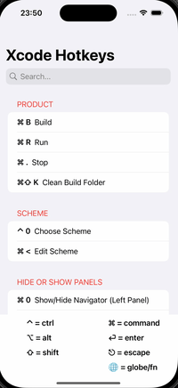

# HotKeys (SwiftUI) ⌨️

A cross-platform SwiftUI app (iPhone, iPad, and Mac) that provides a fast, searchable reference of **Xcode keyboard shortcuts**.  
This repository is primarily a **portfolio project** to showcase Swift/SwiftUI code quality and app structure for job applications.

> ✅ Purpose: share clean, reviewable SwiftUI code and UX patterns across Apple platforms.

---

## Demo
<div align="center">
  
  
  

  <br/>
  <sub>iPhone</sub> &nbsp; &nbsp; <sub>iPad</sub> &nbsp; &nbsp; <sub>macOS</sub>
</div>


---

## Platforms & Minimum OS

- **iOS** (iPhone) — target: 18.5
- **iPadOS** (iPad) — target: 18.5
- **macOS** (Mac) — target: 15.5

> Project is configured as a multi-platform target (SUPPORTED_PLATFORMS: iphoneos, iphonesimulator, macosx xros xrsimulator; DEVICE_FAMILY: 1,2,7).

---

## Highlights

- **SwiftUI-first** UI with a clean separation of concerns (Model / View / ViewModel).
- **Searchable** list of shortcuts with **categorized sections**.
- A built-in **key symbol legend** (⌘ ⌥ ⇧ ⌃ ⎋ ⏎ …) for quick reference.
- **Adaptive layout** (uses size classes; better experience on iPad and Mac windows).
- Centralized **theming** via `Settings/Theme.swift` (typography, sizes).
- **No external dependencies** (pure Swift & SwiftUI).

---

## What’s inside

- **Categories** (11 total): Product, Scheme, Hide or Show Panels, Navigation, Inspector, Structure, Editing, Miscellaneous, Debugging, File menu commands, Source Control
- **Shortcuts**: ~53+ Xcode hotkeys curated into practical groups.
- **Key files**
  - `HotKeysApp.swift` — app entry point (SwiftUI App lifecycle)
  - `View/` — `MainHotkeysView`, `HotkeySectionView`, `HotkeyRow`, `KeySymbolView`
  - `ViewModel/` — `HotkeyCategoryViewModel` (data + filtering)
  - `Model/` — `HotkeyModel`, `HotkeyCategoryModel`, `Modifier`
  - `Settings/Theme.swift` — fonts, weights, sizes, colors
  - `Assets/` — app icon & accent color

---

## Getting Started

### Requirements
- macOS with **Xcode (latest stable recommended)**

### Run
1. Clone:
   ```bash
   git clone https://github.com/HamedKharazmi1990/HotKeysSwiftUIApp.git
   # If your repo name is different, adjust the URL accordingly.
2. Open in Xcode:
    - Open the Xcode project (*.xcodeproj) or workspace (*.xcworkspace if applicable)
3. Choose a destination:
    - iPhone / iPad Simulator
    - My Mac (macOS)
4. Build & Run (⌘R)
